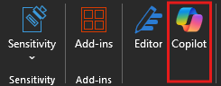

# Word에서 Copilot을 사용하여 주요 정보 간소화 및 추출

Word에서 Microsoft 365 Copilot 사용하려면 리본의 **홈** 탭에서 Copilot 아이콘을 선택하여 **Copilot** 창을 엽니다.

이 유용한 기능은 문서에 대한 광범위하거나 구체적인 질문에 대한 답변을 제공합니다. 결과를 반복하고 구체화하거나, 문서 콘텐츠에 대한 요약 또는 특정 정보를 얻거나, 복사하여 문서에 삽입할 수 있는 아이디어, 테이블 또는 목록을 생성하도록 요청하기 위해 여러 번 토론합니다.

다음 예제에서는 Word의 Copilot에서 기본 프롬프트를 필요한 정보를 필요한 방식으로 제공하는 잘 구성된 상황에 맞는 프롬프트로 전환해 보겠습니다.

## 사용해 보겠습니다.

먼저 **_[Market Analysis Report for Mystic Spice Premium Chai Tea.docx](https://go.microsoft.com/fwlink/?linkid=2268826)_** 파일을 다운로드하고 아직 다운로드하지 않았다면 **OneDrive 폴더**에 저장합니다.

Word에서 문서를 연 다음 리본의 **홈** 탭에서 Copilot 아이콘을 선택하여 **Copilot** 창을 엽니다. 아래 프롬프트를 입력하고 따라합니다.

> [!NOTE]
> 시작 프롬프트:
>
> _이 Word 문서를 요약합니다._

이 간단한 프롬프트에서는 기본 **목표**인 _Word 문서 요약_으로 시작합니다. 그러나 문서를 요약해야 하는 이유나 요약이 필요한 목적에 대한 정보는 없습니다.

| 요소 | 예시 |
| :------ | :------- |
| **기본 프롬프트:** 목표로 **시작** | **이 Word 문서를 요약합니다.** |
| **좋은 프롬프트:** 컨텍스트 **추가** | **컨텍스트**를 추가하면 Copilot이 요약의 목적을 이해하고 그에 따라 응답을 조정하는 데 도움이 됩니다. _“내일 영업 회의에서 팀과 논의할 주요 사항에 대한 간략한 개요와 함께.”_ |
| **더 나은 프롬프트:** 원본 **지정** | **원본**을 추가하면 Copilot이 어떤 문서나 일부를 요약해야 하는지 파악하여 보다 정확한 답변을 제공할 수 있습니다. _"...경쟁 분석 섹션..."_ |
| **최상의 프롬프트:** 명확한 **기대치 설정** | 마지막으로, **기대치**를 추가하면 Copilot이 요약 서식을 지정하는 방법과 필요한 세부 수준을 이해하는 데 도움이 될 수 있습니다. _"요약은 5가지 핵심 사항으로 작성하고 쉬운 언어로 써 줘."_ |

> [!NOTE]
> **완성된 프롬프트**:
>
> _이 Word 문서의 경쟁 분석 섹션을 내일 영업 회의에서 팀과 논의할 주요 요점에 대한 간략한 개요로 요약해 줘. 요약은 5가지 핵심 사항으로 유지하고 간결한 언어로 써 줘._

이 프롬프트에는 **목표**, **컨텍스트**, **원본**, **기대치** 등 필요한 모든 세부 정보가 있으므로 Copilot은 사용자가 원하는 답변을 제공할 수 있습니다.

## 추가 탐색

사용자 고유의 Word 문서를 사용하여 작성한 최종 프롬프트를 사용해 봅니다. **컨텍스트**, **원본** 및 **기대치**를 사용자 지정하여 불필요한 추가 항목 없이 문서에서 필요한 내용을 얻을 수 있도록 합니다.

프롬프트에 컨텍스트나 원본 또는 기대치를 추가하기 위해 생각해 볼 수 있는 다른 방법에는 어떤 것이 있나요? 원하는 응답을 유도하기 위해 사용할 수 있는 다른 프롬프트 전략을 생각해 볼 수 있나요?

> [!IMPORTANT]
> 이 기능은 Microsoft 365 Copilot 라이선스 또는 Copilot Pro 라이선스를 가진 고객이 사용할 수 있습니다. 자세한 내용은 [Word의 Copilot 시작](https://support.microsoft.com/office/welcome-to-copilot-in-word-2135e85f-a467-463b-b2f0-c51a46d625d1)을 참조합니다.

다음 단원에서는 PowerPoint의 Copilot과 유사한 프롬프트를 작성하는 방법을 살펴보겠습니다.
