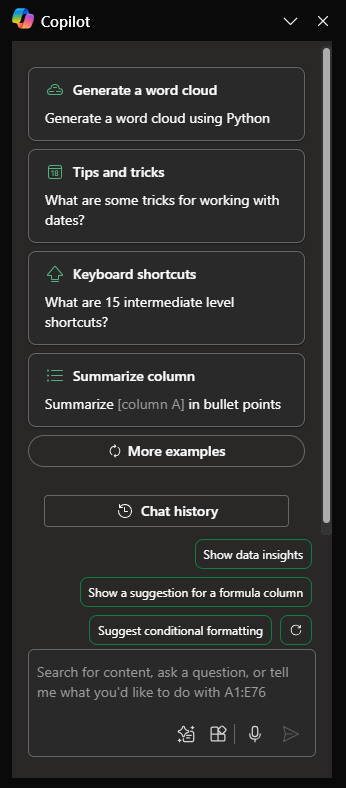

# Excel에서 Copilot을 사용하여 추세 파악 및 데이터 시각화

Excel의 Microsoft 365 Copilot을 사용하면 수식 열 제안을 생성하고, 차트 및 피벗 테이블의 인사이트를 표시하고, 데이터의 흥미로운 부분을 강조 표시하여 Excel 테이블에서 데이터를 더 많이 사용할 수 있습니다.

Excel의 리본에서 **Copilot** 을 선택하여 채팅 창을 엽니다.

Excel에서 Copilot을 사용하려면 데이터 형식을 다음 방법 중 하나로 지정해야 합니다.

- Excel 표로
- 지원 범위로

다음 단계에 따라 테이블을 만들거나, 데이터 범위가 있는 경우 셀 범위를 표로 변환할 수 있습니다.

1. 데이터에서 셀 또는 범위를 선택합니다.

1.  **홈 > 테이블로 서식 지정**을 선택합니다.

1.  **테이블로 형식 지정**  대화 상자에서 범위의 첫 번째 행을 머리글 행으로 지정하려면  **머리글 포함**  옆의 확인란을 선택합니다.

1.  **확인**을 선택합니다.

데이터를 범위에 유지하고 표로 변환하지 않으려면 다음 요구 사항을 모두 충족해야 합니다.

- 머리글 행 하나만
- 머리글은 행이 아닌 열에만 있습니다.
- 머리글은 고유합니다. 중복 머리글 없음
- 빈 머리글 없음
- 데이터는 일관된 방식으로 형식이 지정됩니다.
- 부분합 없음
- 빈 행 또는 열 없음
- 병합된 셀 없음

다음 예에서는 표를 분석하기 위한 기본 요청으로 시작하고 점진적으로 요소를 추가하여 프롬프트를 더욱 강력하게 만듭니다.

## 사용해 보겠습니다.

먼저 **_[Contoso Chai Tea market trends 2023.xlsx](https://go.microsoft.com/fwlink/?linkid=2268822)_** 파일을 다운로드하고 **OneDrive 폴더**에 저장합니다(이미 다운로드하고 저장했다면 건너뜁니다).

Excel에서 스프레드시트를 연 다음 리본의 **홈** 탭에서 Copilot 아이콘을 선택하여 **Copilot** 창을 엽니다. 아래 프롬프트를 입력하고 따라합니다.

> [!NOTE]
> 시작 프롬프트:
>
> _이 테이블을 Excel에서 분석합니다._

이 간단한 프롬프트에서는 기본 **목표**인 _Excel 테이블 분석_으로 시작합니다. 그러나 테이블을 요약해야 하는 이유나 요약이 필요한 목적에 대한 정보는 없습니다.

| 요소 | 예시 |
| :------ | :------- |
| **기본 프롬프트:** 목표로 **시작** | **이 테이블을 Excel에서 분석해 줘.** |
| **좋은 프롬프트:** 컨텍스트 **추가** | **컨텍스트**를 추가하면 Copilot이 분석의 목적을 이해하고 그에 따라 응답을 조정하는 데 도움이 될 수 있습니다. _"장인 제조 차이 판매량 또는 기제조 차이 판매량을 대상으로 5월부터 8월까지 최다 판매 제품을 찾으려고 해."_ |
| **더 나은 프롬프트:** 원본 **지정** | **원본**을 추가하면 Copilot이 특정 정보나 범위를 사용하도록 지시하여 범위를 좁히는 데 도움이 됩니다. _"...장인 제조 차이 판매량 또는 기제조 차이 판매량을 대상으로 5월부터 8월까지...."_ |
| **최상의 프롬프트:** 명확한 **기대치 설정** | 마지막으로, **기대치**를 추가하면 Copilot이 요약 서식을 지정하는 방법과 필요한 세부 수준을 이해하는 데 도움이 될 수 있습니다. _"월별 최다 판매 제품을 요약해 줘."_ |

> [!NOTE]
> **완성된 프롬프트**:
>
> _Excel에서 이 표를 분석합니다. 장인 제조 차이 판매량 또는 기제조 차이 판매량을 대상으로 5월부터 8월까지 최다 판매 제품을 찾으려고 힙니다. 월 별 최다 판매 제품을 요약하세요._

이 프롬프트는 Copilot에게 **목표**, **컨텍스트**, **원본**, **기대치** 등 올바른 답을 도출하는 데 필요한 모든 정보를 제공합니다.

## 추가 탐색

최종 작성된 프롬프트와 다른 프롬프트들을 직접 만든 Excel 테이블로 사용해 봅니다. 다음은 시도할 수 있는 프롬프트에 대한 몇 가지 제안 사항입니다. 복사하여 **컨텍스트**, **원본**, **기대치**에 추가합니다.  

- 시간 경과에 따른 범주별 매출을 그립니다.

- 각 제품의 총 을 표시합니다.

- 작년 각 지역의 총 광고 판매액을 표시합니다.

> [!IMPORTANT]
> 이 기능은 Microsoft 365 Copilot 라이선스 또는 Copilot Pro 라이선스를 가진 고객이 사용할 수 있습니다. Excel 테이블와 테이블을 만드는 방법에 대해 자세히 알아보려면 [Excel에서 테이블 만들기](https://support.microsoft.com/office/bf0ce08b-d012-42ec-8ecf-a2259c9faf3f)를 참조합니다.
