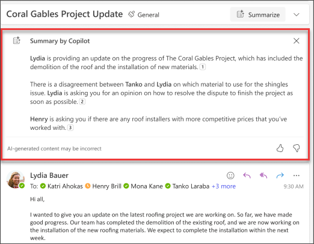

# Outlook에서 Copilot을 사용하여 한 주 동안 캐치 업 및 준비

Outlook의 Copilot은 AI 기반 지원을 통해 받은 편지함 관리를 더 쉽게 만들어 이메일을 빠르게 작성하고 긴 이메일 스레드를 짧은 요약으로 전환할 수 있도록 지원합니다. LLM(대규모 언어 모델)의 기능을 Outlook 데이터와 결합하여 작업 공간의 생산성을 유지할 수 있습니다. 전자 메일 스레드(대화라고도 함)를 요약하여 여러 메시지에서 주요 포인트를 끌어낼 수 있습니다.

**Copilot 요약**이 이메일 컨텍스트 내에서 선택되면 Copilot은 스레드를 기반으로 요약을 자동으로 제공합니다. 일반적인 사용 사례는 긴 전자 메일을 요약하여 어떤 결정이 내려졌는지 및 스레드에서 다른 사용자가 제안한 작업을 확인합니다.

완료되면 요약이 전자 메일의 맨 위에 표시되며, 선택하면 스레드의 해당 전자 메일로 이동되는 번호가 매겨진 인용도 포함됩니다.

## 사용해 보겠습니다.

기본 요약 기능을 사용하는 대신 도구 모음에서 Outlook의 Copilot 창을 열고 프롬프트를 따릅니다. 그러나 이메일의 특정 상황은 다양하므로 상황에 맞게 프롬프트를 조정해야 합니다.

> [!NOTE]
> 시작 프롬프트:
>
> _이 전자 메일 대화를 요약합니다._

이 간단한 프롬프트에서는 _이메일 대화를 요약하는_ 기본 **목표**부터 시작합니다. 그러나 요약이 필요한 이유 또는 원하는 항목에 대한 정보는 없습니다.

| 요소 | 예시 |
| :------ | :------- |
| **기본 프롬프트:** 목표로 **시작** | **이 전자 메일 대화를 요약합니다.** |
| **좋은 프롬프트:** 컨텍스트 **추가** | **컨텍스트**를 추가하면 Copilot이 목적을 이해하고 그에 따라 응답을 조정하는 데 도움이 될 수 있습니다. _"나에게 할당된 작업 항목에 대한 간략한 개요가 필요해.."_ |
| **더 나은 프롬프트:** 원본 **지정** | **원본**을 추가하면 Copilot이 요약해야 하는 부분을 이해하고 보다 정확한 응답을 제공할 수 있습니다. _"...목요일에 전송된 프로젝트 계획에서."_ |
| **최상의 프롬프트:** 명확한 **기대치 설정** | 마지막으로, **기대치**를 추가하면 Copilot이 요약 서식을 지정하는 방법과 필요한 세부 수준을 이해하는 데 도움이 될 수 있습니다. _"모든 작업 항목과 할당된 소유자가 포함된 표를 만들고 나에게 할당된 항목을 강조 표시해 줘."_ |

> [!NOTE]
> **완성된 프롬프트**:
>
> _이 이메일 대화를 요약해 줘. 목요일에 전송된 프로젝트 계획에서 나에게 할당된 작업 항목에 대한 간략한 개요가 필요해. 모든 작업 항목과 할당된 소유자가 포함된 테이블을 만들고 나에게 할당된 항목을 강조 표시해 줘._

이 프롬프트에서 Copilot은 프롬프트의 **목표**, **컨텍스트**, **원본** 및 **기대치** 덕분에 확실한 답변을 제공하는 데 필요한 모든 정보를 획득합니다.

> [!IMPORTANT]
> Outlook의 Copilot에서는 현재 회사 또는 학교 계정 및 outlook.com, hotmail.com, live.com 및 msn.com 이메일 주소를 사용하는 Microsoft 계정만 지원합니다. Gmail, Yahoo 또는 iCloud와 같은 타사 이메일 공급자의 계정을 사용하는 모든 Microsoft 계정은 계속해서 Outlook을 사용할 수 있지만 Outlook의 Copilot 기능에는 액세스할 수 없습니다. 자세한 내용은 [Outlook에서 Copilot을 사용하여 이메일 스레드 요약](https://support.microsoft.com/office/summarize-an-email-thread-with-copilot-in-outlook-a79873f2-396b-46dc-b852-7fe5947ab640)을 참조 하세요.
