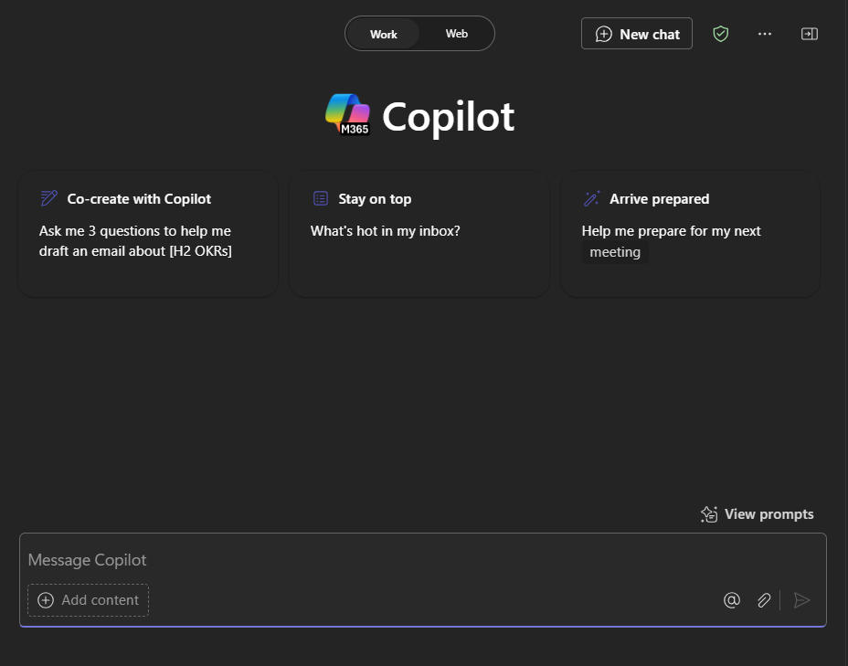

# Microsoft 365 Copilot Chat을 사용하여 새로운 아이디어, 목록 및 보고서를 브레인스토밍

Microsoft 365 Copilot Chat(Copilot Chat)은 AI(인공 지능)의 기능을 작업 데이터 및 앱과 결합하여 창의력을 발휘하고 생산성을 높이며 기술을 향상시키는 데 도움을 줍니다. 여러 앱 및 콘텐츠에서 작동하여 안전한 작업 데이터와 함께 AI의 기능을 제공합니다. 정보를 합성하고 여러 원본에서 한 번에 항목을 만들 수 있으므로 더 광범위한 목표와 목적을 해결할 수 있습니다.

비교하자면, 다른 Microsoft 365 앱(예: Word 또는 PowerPoint)의 Copilot은 **해당 앱 내에서** 지원하기 위해 특별히 오케스트레이션됩니다. 예를 들어 Word의 Copilot은 콘텐츠의 초안 작성, 편집, 사용을 개선할 수 있도록 설계되었습니다. PowerPoint에서는 더 나은 프레젠테이션을 만드는 데 도움이 됩니다. 하지만 Copilot Chat을 사용하면 이 모든 것을 새로운 환경으로 끌어올 수 있습니다.

여러 가지 방법으로 Copilot Chat에 액세스할 수 있습니다.

- 데스크톱 및 모바일 버전의 Microsoft Teams에서 Copilot을 사용합니다. [Teams에서 Copilot Chat 사용](https://support.microsoft.com/topic/open-microsoft-365-chat-in-teams-c6de0a62-4f9e-479d-b5f2-af036e342181)을 참조합니다.

- Microsoft.com/Copilot의 Copilot Chat에 액세스합니다. [Microsoft365.com/copilot에서 Copilot Chat 사용](https://support.microsoft.com/topic/use-microsoft-365-chat-at-microsoft365-com-or-in-the-microsoft-365-office-app-4a2538f9-962f-4c7c-a368-f6006bc13d6f)을 참조합니다.

## 사용해 보겠습니다.

이전 단원의 **Contoso CipherGuard Product Specification.docx**를 사용하여 Teams에서 Copilot Chat을 열어 다음 프롬프트를 질문합니다.

> [!NOTE]
> 시작 프롬프트:
>
> _모임 어젠더를 빌드합니다._

이 간단한 프롬프트에서는 기본 **목표**인 _모임 어젠더 빌드_로 시작합니다. 그러나 모임의 목적이나 목표에 대한 정보가 많지 않습니다.

| 요소 | 예시 |
| :------ | :------- |
| **기본 프롬프트:** 목표로 **시작** | **_모임 어젠더를 빌드해 ._** |
| **좋은 프롬프트:** 컨텍스트 **추가** | **컨텍스트**를 추가하면 Copilot이 모임을 호출하는 이유와 논의할 내용을 파악하는 데 도움이 됩니다. _"프로젝트 목표, 사명 선언문 및 예정된 완료 날짜를 포함하여 클라이언트 모임이 한 시간 동안 지속되도록..."_ |
| **더 나은 프롬프트:** 원본 **지정** | **원본**을 추가하면 Copilot이 특정 정보를 찾을 수 있는 위치를 파악하는 데 도움이 됩니다. _" **/Contoso CipherGuard Product Specification.docx** 정보를 사용하고 열린 항목 및 답변이 없는 질문을 찾아줘."_ |
| **최상의 프롬프트:** 명확한 **기대치 설정** | 마지막으로 **기대치**를 추가하면 Copilot이 문서를 작성하고 서식을 지정하는 방법을 이해하는 데 도움이 됩니다. _"어젠더는 시간 할당이 있는 테이블 형식이어야 하고, 사람들이 마지막에 질문을 할 수 있도록 기회를 줘."_ |

> [!NOTE]
> **완성된 프롬프트**:
>
> _프로젝트 목표, 사명 선언문, 예정된 완료 날짜를 포함하여 클라이언트 모임이 한 시간 동안 지속되도록 모임의 어젠더를 작성해 줘. **/Contoso CipherGuard Product Specification.docx** 정보를 사용해서 열린 항목과 답변이 없는 질문을 찾아줘. 어젠더는 시간 할당이 있는 테이블 형식으로 작성하고 마지막에 사람들이 질문할 수 있도록 기회를 줘._

어젠더를 검토하고 조정하거나 수정한 다음 Teams의 모임 초대에 추가합니다.

### 원본 참조

예제에서와 같이 Copilot이 이미 있는 파일, 모임 또는 사람(세 가지 모두일 수도 있음)에서 새 프레젠테이션을 기반으로 하려면 이 작업을 수행하도록 지시할 수 있습니다. 프롬프트 창에서 정방향 슬래시 "/"를 입력하기 시작하면 최근 모임, 파일 또는 참조할 사람을 알려주는 팝업 창이 나타납니다.

> [!IMPORTANT]
> 참조하는 파일에 액세스할 수 있는 권한이 있어야 하며, 해당 파일이 조직의 SharePoint 또는 OneDrive에 있거나 또는 Word, Excel 또는 PowerPoint 파일 형식이어도 됩니다.

## 추가 탐색

다음은 시도할 수 있는 프롬프트에 대한 몇 가지 제안 사항입니다. 필요에 맞게 복사하고 수정합니다.

- 지난 모임에서 무슨 일이 있었나요?

- 읽지 않은 채팅을 따라잡으세요.

- 다음 주에 OKR이 마감된다는 메시지의 초안을 작성합니다.

- 우리 팀에 제품 전략을 어떻게 업데이트했는지 알려줍니다.

- 어젯밤에 발생한 [고객] 에스컬레이션에 관한 채팅, 이메일 및 문서를 요약합니다.

- [프로젝트]의 다음 마일스톤은 무엇인가요? 위험이 있나요? 완화할 수 있는 몇 가지 잠재적인 방법 목록을 브레인스토밍하도록 도움을 주세요.

- [파일] 스타일로 작성하되, [다른 파일]의 타임라인을 포함하고 [사람]이 보낸 이메일의 프로젝트 목록을 통합한 계획 개요를 작성합니다.
