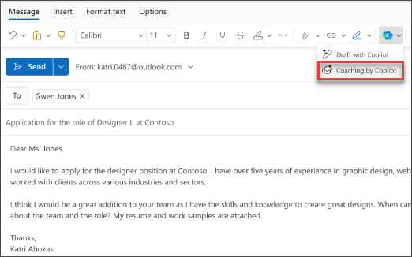

# Outlook에서 Microsoft 365 Copilot을 사용하여 어조에 대한 메시지 및 회신 다시 작성

작성할 중요한 전자 메일이 있고 의도한 메시지를 효과적으로 전달한다고 확신하고 싶으신가요? Outlook에서 Copilot을 사용하면 보내기를 누르기 전에 톤, 명확도 및 독자 감정을 조정하는 방법에 대한 유용한 제안을 얻을 수 있습니다.

1. Outlook에서 **홈 > 새 메일 > 메일**을 선택합니다. 전자 메일 메시지를 입력합니다.

1. 도구 모음에서 **Copilot** 아이콘을 선택합니다. 드롭다운 메뉴에서 **Copilot으로 코칭**을 .

    

1. Copilot은 전자 메일을 검토하고 톤, 명확도 및 독자 감정 개선에 대한 제안을 제공합니다.

1. 제안 사항이 있거나 모두 마음에 들면 피드백을 초안에 통합합니다. 만족하면 전자 메일을 보냅니다.

    

다음 예제에서는 간단한 프롬프트로 시작하고 그 과정에서 요소를 추가합니다. Copilot 를 사용하여 전자 메일 초안을 작성한 후 예제를 따릅니다.

## 사용해 보겠습니다.

**먼저 Outlook에서 Copilot에게 다음 프롬프트를 사용하여 가상 전자 메일** 초안을 작성하도록 요청합니다.  

> _최신 소프트웨어 릴리스에 대해 고객을 위한 간단한 제품 업데이트 공지 초안을 작성하되, 새로운 주요 기능, 개선 사항, 사용자에게 어떻게 도움이 되는지를 강조해 줘._  

> [!NOTE]
> 시작 프롬프트:
>
> _이 이메일을 검토하고 개선을 위한 제안을 해봅니다._

이 간단한 프롬프트에서는 기본 **목표**인 _이메일 개선_부터 시작합니다. 그러나 어떤 종류의 개선이 필요한지에 대한 자세한 내용은 없습니다.  

| 요소 | 예시 |
| :------ | :------- |
| **기본 프롬프트:** 목표로 **시작** | **_이 전자 메일을 좀 더 공식적인 느낌으로 만듭니다._** |
| **좋은 프롬프트:** 컨텍스트 **추가** | **컨텍스트**를 추가하면 Copilot이 전자 메일의 목적과 필요한 개선 사항을 이해하는 데 도움이 됩니다. _"... 따뜻하고 호감 가는 톤은 유지하면서 더 전문적이고 세련된 인상을 주면 좋겠어."_ |
| **더 나은 프롬프트:** 원본 **지정** | 이 프롬프트의 **원본**는 Outlook에서 이미 초안을 작성한 전자 메일입니다. _"...이 이메일."_ |
| **최상의 프롬프트:** 명확한 **기대치 설정** | **기대치**를 추가하면 Copilot이 원하는 변경 사항을 이해하는 데 도움이 됩니다. _"전문적이고 간결하며 제품 업데이트의 주요 세부 정보를 명확하게 설명한 전자 메일이어야 해."_ |

> [!NOTE]  
> **완성된 프롬프트**:  
>
> _이 전자 메일을 좀 더 공식적인 느낌으로 만듭니다. 전문적이고 간결하며 제품 업데이트의 주요 세부 정보를 명확하게 다루는 전자 메일이어야 ._  

이 프롬프트는 Copilot에게 **목표**, **컨텍스트**, **원본**, **기대치** 등 올바른 답을 도출하는 데 필요한 모든 정보를 제공합니다.
