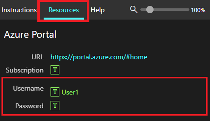

이 모듈에서는 다음 파일을 참조하는 Microsoft 365 Copilot용 프롬프트를 만들어 보겠습니다.

- [Market Analysis Report for Mystic Spice Premium Chai Tea.docx](https://go.microsoft.com/fwlink/?linkid=2268826)
- [Mystic Spice Premium Chai Market Analysis Presentation.pptx](https://go.microsoft.com/fwlink/?linkid=2268768)
- [Mystic Spice Premium Chai Tea product description.docx](https://go.microsoft.com/fwlink/?linkid=2268929)
- [Fabrikam Q1 marketing campaigns.xlsx](https://go.microsoft.com/fwlink/?linkid=2269124)

**참고**: 이 파일들은 모듈 전체에서 참조할 파일입니다. 하지만 이 랩에서는 모든 파일을 **OneDrive**에 업로드하여 나중에 Copilot 프롬프트에 액세스할 수 있도록 하겠습니다.

### OneDrive에 파일 업로드

아래 단계에 따라 필요한 모든 파일을 **OneDrive**에 업로드합니다.

1. 테넌트 공급자가 제공한 가상 머신에 로컬 **관리자** 계정으로 암호를 사용하여 로그인합니다.`Pa55w.rd`
2. Windows 작업 표시줄에서 **Microsoft Edge**를 선택합니다.
3. 주소 표시줄에 `https://www.office.com`을 입력합니다.
4. **Microsoft 365 시작**에서 **로그인**을 선택합니다.
5. **로그인 프롬프트**에서 `userx@yourtenant.onmicrosoft.com`(테넌트가 제공한 사용자 이름과 테넌트) 입력 후 **다음**을 선택합니다.

    
    
6. **암호 입력** 화면에서 사용자 계정의 암호(테넌트 공급자가 제공)를 입력한 후 **로그인**을 선택합니다.
7. **로그인 유지**라는 메시지가 표시되면 **다시 표시하지 않음**을 선택한 다음 **예**를 선택합니다.
8. **Microsoft 365**에서 **앱**을 선택합니다.
9. **앱**에서 **OneDrive**를 선택합니다.
10. **OneDrive**의 왼쪽 상단에서 **+**(새로 추가) > **파일 업로드**를 선택합니다.
11. **파일 탐색기**에서 **내 PC** > **로컬 디스크(C:)** 를 선택하고 **ResourceFiles** 폴더를 엽니다.
12. **ResourceFiles** 폴더 내의 모든 파일을 선택한 다음 **열기**를 선택하여 **OneDrive**에 업로드합니다.
13. 업로드가 완료되면 화면 중앙 하단에 **내 파일에 29개 항목 업로드됨**이 표시됩니다.
14. **Edge**를 열어 두고 다음 작업으로 이동합니다.

### Copilot에서 파일 참조

Copilot을 사용할 때 일부 파일은 제안에서 즉시 사용할 수 없는 경우가 있습니다. 일부 Copilot 환경에서는 **최근에 사용한 목록**의 파일만 참조하는 반면, 다른 환경에서는 **OneDrive**를 직접 찾아볼 수 있기 때문에 이러한 현상이 발생합니다. 파일이 **최근에 사용한 목록**에 표시되도록 하려면 관련 Microsoft 365 앱에서 파일을 열기만 하면 자동으로 추가됩니다.

> [!IMPORTANT]
> Microsoft 365 Copilot은 **OneDrive**에 저장된 파일로만 작업할 수 있습니다. PC에 로컬로 저장된 파일은 Copilot에서 액세스하려면 **OneDrive**로 이동해야 합니다.

모듈을 진행하면서 이러한 파일에 대해 다양한 프롬프트를 시도해 볼 수 있습니다. Copilot 사용 실력을 향상시키기 위해 다양한 접근 방식으로 자유롭게 실험해 보세요.